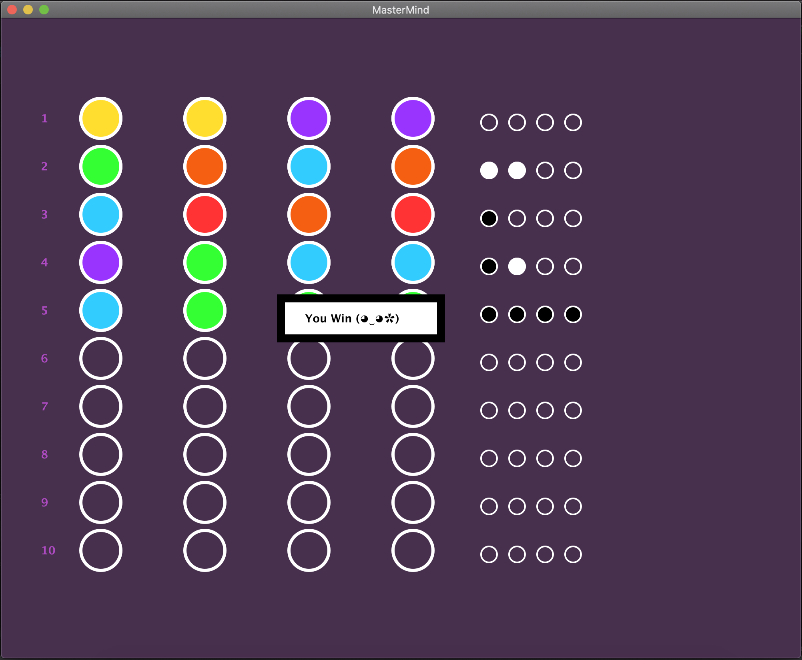
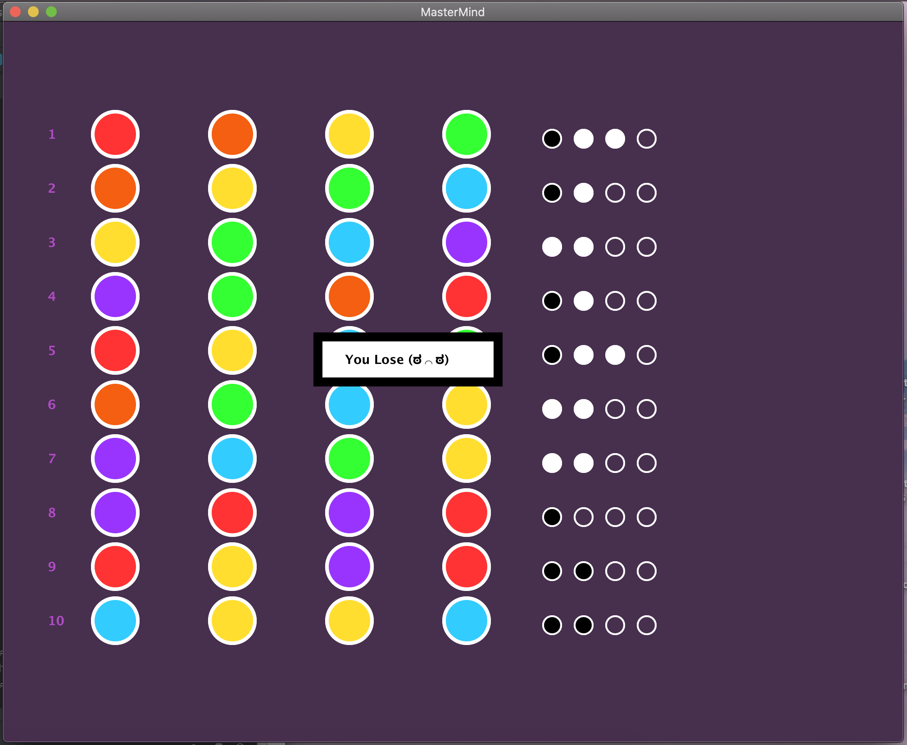

# Mastermind

## Overview
This project is a short java program featuring a graphical user interface built based on the Mastermind game. The Mastermind Game was originally a board game developed by Mordecai Meirowitz and has made its way onto digital platforms. Mastermind is a two-player code-breaking game involving a four-color code and black and white pegs to allow the player to gauge the accuracy of their guesses. In this project, the user is able to select the option to play or to have the computer play in their stead. Ten guesses is the default number of guesses for the human user, and the five guess algorithm is implemented for the computer player option. The Five Guess Algorithm developed by Donald Knuth demonstrates that the codebreaker can solve the code in five moves or less using an algorithm that progressively reduces the number of possible patterns. In this project, the program will generate a secret code, and the computer will always solve the code in five guesses. Below is a preview of what the game looks like when the five guess algorithm is called upon. There are five colors that can be combined to produce a four color code as shown in the larger orbs. Instead of black and white pegs, there is a row of four smaller orbs beside the larger ones to indicate the accuracy of the guesses. White orbs indicate that the colors are correct, while black orbs means both the position and color are correct, and an empty orb means neither is correct.

This project contains several classes and interfaces, including a main function that runs the program. When the code is run from the main, the graphics game objects are created including a new canvas window, banner for the instructions, and the board. The board holds all of the rows and manages row production based on the user’s guesses. There is an orb interface that the large and small orbs implement to update the row of empty orbs with the correct colors respective to the user’s guesses. The program also has a game manager class that controls and contains all of the graphics elements within the game to ensure the desired outcome is produced and smooth running of the program. 

What allows the implementation of the five guess algorithm to run is the solver algorithm. The solver algorithm draws inspiration from Donald Knuth’s MinMax algorithm that is essentially a function that will return a code object that is the most likely code to win the game or come close to winning the game.

## Tools
Tools that were utilized throughout the project include the Graphics package for Comp127 to create the visual interface through abstractions and object placement. 

## Authors
Mphatso Simbao, Jessica Ho, Leah Robotham 

## Contact
https://github.com/msimbao/masterMindPickFiveAlgorithm.git

## Acknowledgments
Donald Knuth
COMP-127 Preceptors
